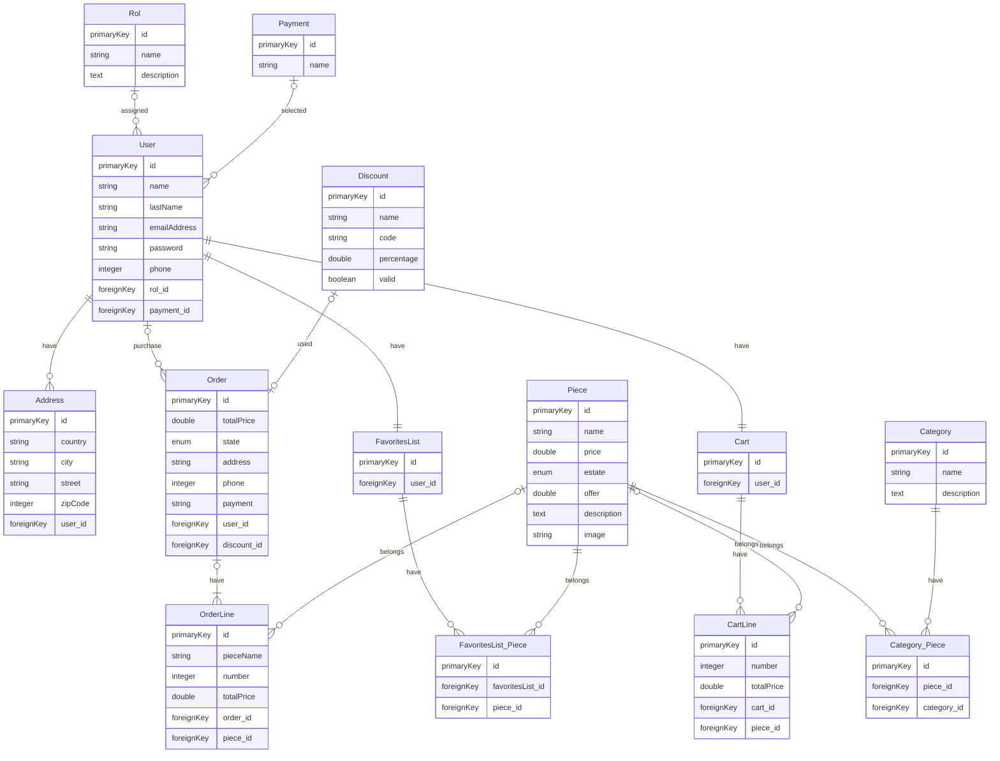

# Memoria
## Grupo
Miembros:  
- Sergio Parejo Muñoz
- José Antonio Gutiérrez Inurria
- Carlos Lacave Muñoz
 
Color asignado: Naranja

Tema: Ecommerce de piezas de coches
## Diagrama

```mermaid
erDiagram
User {
	primaryKey id
	string name
	string lastName
	string emailAddress
	string password
	integer phone
	foreignKey rol_id
	foreignKey payment_id
}
Rol {
	primaryKey id
	string name
	text description
}
Payment {
	primaryKey id
	string name
}
Address {
	primaryKey id
    string country
    string city
	string street
	integer zipCode
	foreignKey user_id
}
Discount {
	primaryKey id
	string name
	string code
	double percentage
	boolean valid
}
Order {
	primaryKey id
	double totalPrice
	enum state
	string address
	integer phone
	string payment
	foreignKey user_id
	foreignKey discount_id
}
OrderLine {
	primaryKey id
    string pieceName
	integer number
	double totalPrice
	foreignKey order_id
	foreignKey piece_id
}
FavoritesList {
	primaryKey id
	foreignKey user_id
}
FavoritesList_Piece {
	primaryKey id
	foreignKey favoritesList_id
	foreignKey piece_id
}
Cart {
	primaryKey id
	foreignKey user_id
}
CartLine {
	primaryKey id
	integer number
	double totalPrice
	foreignKey cart_id
	foreignKey piece_id
}
Piece {
	primaryKey id
    string name
	double price
	enum estate
	double offer
	text description
	string image
}
Category_Piece {
	primaryKey id
	foreignKey piece_id
	foreignKey category_id
}
Category {
	primaryKey id
	string name
	text description
}
Rol |o--o{ User : assigned
Payment |o--o{ User : selected
User ||--o{ Address : have
User |o--o{ Order : purchase
User ||--|| FavoritesList : have
User ||--|| Cart : have
Discount |o--o| Order : used
Order |o--|{ OrderLine : have
Cart ||--o{ CartLine : have
Piece |o--o{ OrderLine : belongs
FavoritesList ||--o{ FavoritesList_Piece : have
Piece ||--o{ FavoritesList_Piece : belongs
Piece |o--o{ CartLine : belongs
Piece ||--o{ Category_Piece : belongs
Category ||--o{ Category_Piece : have
```
